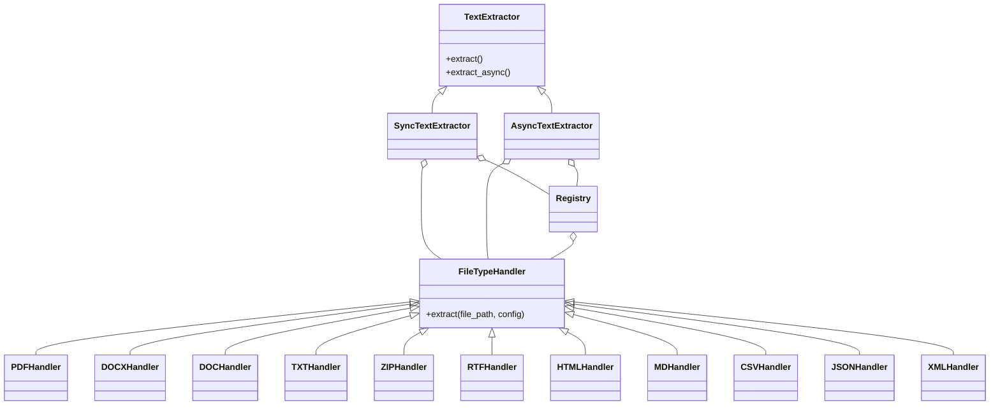

# TextXtract Package: Architectural Plan

## 1. Package Structure

```
textxtract/
├── __init__.py
├── core/
│   ├── __init__.py
│   ├── base.py                # Abstract base classes for extractors and handlers
│   ├── utils.py               # File validation, temp file management, security
│   ├── config.py              # Configuration system (env, validation, per-handler)
│   ├── exceptions.py          # Custom exceptions
│   ├── logging_config.py      # Logging setup
│   └── registry.py            # Central handler registry (singleton, lazy loading)
├── sync/
│   ├── __init__.py
│   └── extractor.py           # Synchronous extraction logic (uses registry)
├── aio/
│   ├── __init__.py
│   └── extractor.py           # Asynchronous extraction logic (ThreadPool, context manager)
├── handlers/
│   ├── __init__.py
│   ├── pdf.py                 # PDF extraction (robust, empty page handling)
│   ├── docx.py                # DOCX extraction
│   ├── doc.py                 # DOC extraction (antiword + fallback)
│   ├── txt.py                 # TXT extraction
│   ├── zip.py                 # ZIP extraction (security checks, recursion)
│   ├── rtf.py                 # RTF extraction (striprtf)
│   ├── html.py                # HTML extraction
│   ├── md.py                  # Markdown extraction
│   ├── csv.py                 # CSV extraction
│   ├── json.py                # JSON extraction
│   └── xml.py                 # XML extraction
├── tests/
│   ├── __init__.py
│   ├── test_sync.py
│   ├── test_async.py
│   ├── test_edge_cases.py     # Security, resource, and error edge cases
│   ├── test_exceptions.py
│   └── files/                 # Test data files
├── __main__.py                # CLI entry point (optional)
```

## 2. Abstractions

- [`core/base.py`](textxtract/core/base.py):  
  - `TextExtractor` (ABC): defines extract/extract_async, config, error handling.
  - `FileTypeHandler` (ABC): interface for file-specific extraction.

## 3. Sync & Async Extraction

- [`sync/extractor.py`](textxtract/sync/extractor.py):  
  - Implements sync extraction using handler registry.
- [`aio/extractor.py`](textxtract/aio/extractor.py):  
  - Implements async extraction using handler registry, ThreadPoolExecutor, proper resource cleanup, async context manager.

## 4. File Handlers

- [`handlers/*`](textxtract/handlers/):  
  - Each file type (PDF, DOCX, DOC, TXT, ZIP, RTF, HTML, MD, CSV, JSON, XML) has a dedicated handler.
  - Handlers registered and managed via the central registry.
  - Security: ZIP handler checks for path traversal, file size, malicious names.

## 5. Error Handling & Logging

- [`core/exceptions.py`](textxtract/core/exceptions.py):  
  - Custom exceptions: `InvalidFileError`, `ExtractionError`, `FileTypeNotSupportedError`, etc.
- [`core/logging_config.py`](textxtract/core/logging_config.py):  
  - Centralized logging, configurable via config.

## 6. Configuration & Customization

- [`core/config.py`](textxtract/core/config.py):  
  - Supports environment variables, type validation, per-handler config, and config files (JSON/YAML/TOML).

## 7. Security & Resource Management

- [`core/utils.py`](textxtract/core/utils.py):  
  - File size limits, filename/path validation, temp file cleanup.
- [`aio/extractor.py`](textxtract/aio/extractor.py):  
  - ThreadPoolExecutor cleanup, atexit registration, async context manager.

## 8. Testing

- [`tests/`](textxtract/tests/):  
  - Unit and edge case tests for all handlers, extractors, and error conditions.
  - Uses `pytest` and `pytest-asyncio`.

## 9. Documentation

- [`mkdocs.yml` + `scripts/generate_docs.py`]:  
  - Automated API docs for all modules.
  - Material theme, search, and navigation enhancements.

## 10. Dependencies

- [`pyproject.toml`](pyproject.toml):  
  - Main, optional, and dev dependencies clearly separated.

---

## Mermaid Diagram: High-Level Architecture



---

## Key Features

- **Extensible:** Add new file handlers by subclassing `FileTypeHandler` and registering.
- **Sync & Async:** Both interfaces, async is truly non-blocking.
- **Robust:** Comprehensive error handling, logging, and resource management.
- **Configurable:** Encoding, logging, handler registration, timeouts, per-handler config.
- **Testable:** Pytest-based tests for all components, including edge cases.
- **Scalable:** Lazy loading, caching, parallel processing (future-proofed).
- **Secure:** Input validation, safe file handling, ZIP traversal protection.

---

## Implementation Steps

1. Scaffold the directory and file structure.
2. Implement core abstractions and utilities.
3. Implement file type handlers.
4. Implement sync and async extractors.
5. Add configuration, logging, and error handling.
6. Write comprehensive tests (unit, async, edge cases).
7. Document usage and API (auto-generated docs).
8. Finalize dependencies and code quality checks.