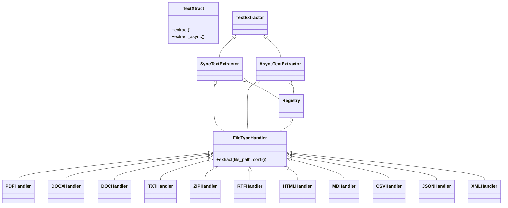

# TextXtract Package: Architectural Plan

## Mermaid Diagram: High-Level Architecture

---

## Key Features

- **Extensible:** Add new file handlers by subclassing `FileTypeHandler` and registering.
- **Sync & Async:** Both interfaces, async is truly non-blocking.
- **Robust:** Comprehensive error handling, logging, and resource management.
- **Configurable:** Encoding, logging, handler registration, timeouts, per-handler config.
- **Testable:** Pytest-based tests for all components, including edge cases.
- **Scalable:** Lazy loading, caching, parallel processing (future-proofed).
- **Secure:** Input validation, safe file handling, ZIP traversal protection.

---

## Implementation Steps

1. Scaffold the directory and file structure.
2. Implement core abstractions and utilities.
3. Implement file type handlers.
4. Implement sync and async extractors.
5. Add configuration, logging, and error handling.
6. Write comprehensive tests (unit, async, edge cases).
7. Document usage and API (auto-generated docs).
8. Finalize dependencies and code quality checks.

## API Reference
Checkout the main [API Reference](/reference/) for detailed documentation on each class and method.